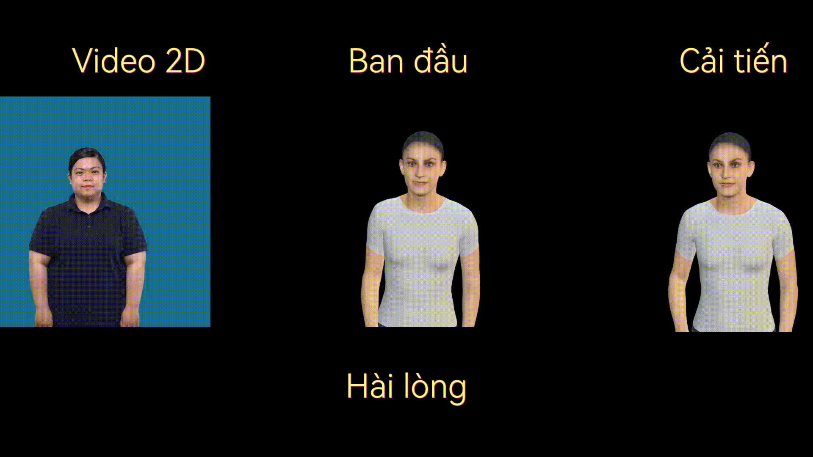
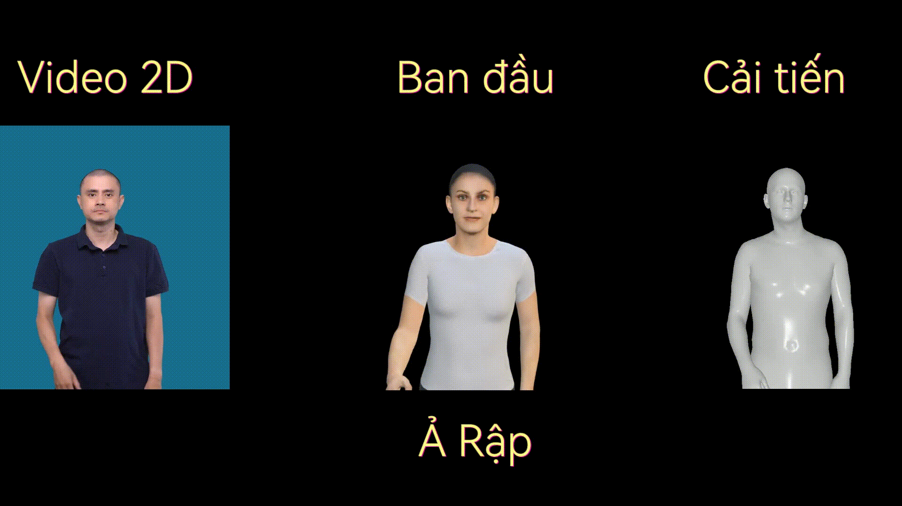
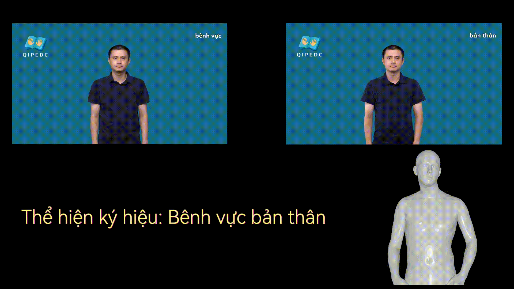
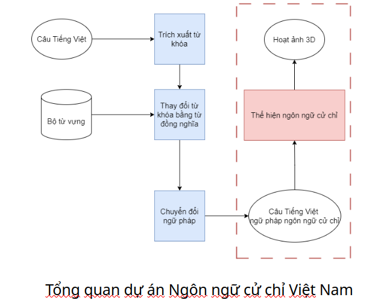
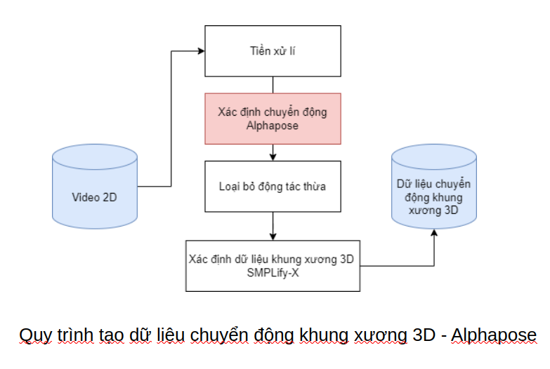
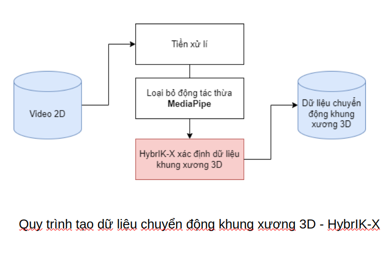

# NGHIÊN CỨU ĐỀ XUẤT PHƯƠNG PHÁP THỂ HIỆN NGÔN NGỮ CỬ CHỈ HỖ TRỢ NGƯỜI KHIẾM THÍNH

 <h1 align="center">Khóa luận tốt nghiệp</h1>

## GIỚI THIỆU
Nghiên cứu đề xuất các phương pháp thể hiện ngôn ngữ cử chỉ và đề xuất cải tiến hệ thống dịch ngôn ngữ cử chỉ mô phỏng ngôn ngữ ký hiệu
bằng các nhân vật 3D.

* Hệ thống: 
Input: câu, từ (chuẩn ngữ pháp ngôn ngữ cử chỉ) 
Output: nhân vật 3D thể hiện ý nghĩa câu đầu vào.

## DEMO
* Hướng phát triển 1: Cải tiến tối ưu về tốc độ hệ thống.

   
  <i>Hài lòng</i>

 
* Hướng phát triển 2: Cải tiến tối ưu về tốc độ và độ chính xác.

   
  <i>Ả Rập</i>

 

   
  <i>Câu hoàn chỉnh</i>

 

## NỘI DUNG

   
 
* Hướng phát triển 1: Đề xuất thêm phương pháp pose estimation: Alphapose <a> https://github.com/MVIG-SJTU/AlphaPose </a> thay thế cho Openpose và tích hợp vào hệ thống.

   

* Hướng phát triển 2: Đề xuất sử dụng phương pháp tạo dữ liệu chuyển động khung xương 3d bằng Hybrik-X <a>https://github.com/jeffffffli/HybrIK/tree/main?tab=readme-ov-file</a> và xây dựng lại hệ thống.

   

